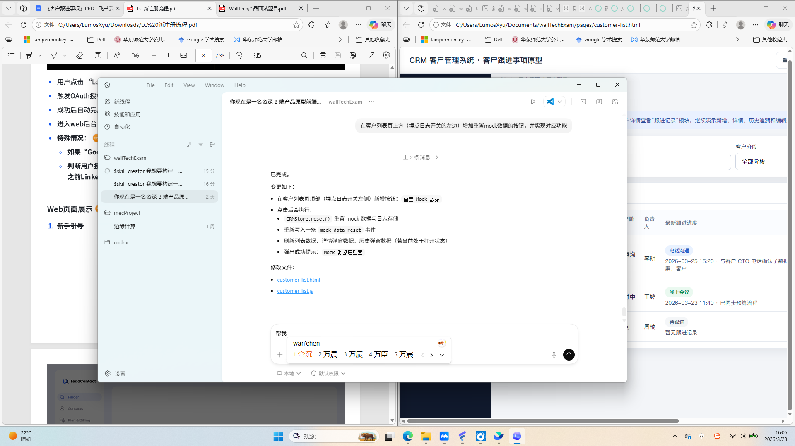
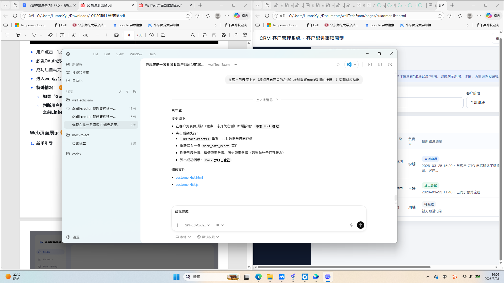

# PRD 详细设计(按页面)

- 生成时间: `2026-03-28 16:06:25`
- 代码识别策略: `mtime-72h`
- 分析文件数量: `18`
- 截图模式: `auto`

## 本次纳入分析的新增/变更文件
- `pages/customer-list.js`
- `pages/customer-list.html`
- `pages/customer-detail.js`
- `assets/js/store.js`
- `pages/customer-detail.html`
- `pages/customer-list.css`
- `assets/css/common.css`
- `pages/customer-detail.css`
- `pages/followup-history.html`
- `pages/followup-detail.html`
- `pages/new-followup.html`
- `pages/followup-history.js`
- `pages/followup-history.css`
- `pages/followup-detail.js`
- `index.html`
- `pages/followup-detail.css`
- `pages/new-followup.js`
- `pages/new-followup.css`

## 页面设计清单
- `customer-detail`
- `customer-list`
- `followup-detail`
- `followup-history`
- `new-followup`

## 页面: 客户详情 - 跳转中

### 变更代码范围
- `pages/customer-detail.html`
- `pages/customer-detail.js`
- `pages/customer-detail.css`
- 共享依赖:
  - `assets/js/store.js`
  - `assets/css/common.css`
  - `index.html`

### 功能点详细设计
1. 触发机制: `click: node -> function`
   - 入口交互: 用户触发事件。
   - 系统行为: 执行对应逻辑并更新状态。
   - 结果反馈: 展示成功、失败或空态。
2. 触发机制: `click: doneNode -> function`
   - 入口交互: 用户触发事件。
   - 系统行为: 执行对应逻辑并更新状态。
   - 结果反馈: 展示成功、失败或空态。

### 交互流程
1. 用户进入页面，系统初始化默认状态。
4. 系统在本地状态层处理并刷新界面。
5. 页面进入成功态、失败态或空态。

### 边界情况
- 存在空值处理逻辑，需定义字段为空时提示与阻断规则。
- 存在必填校验逻辑，需明确校验时机和提示文案。
- 存在上限控制，需明确边界值和超限反馈。
- 存在下限控制，需明确边界值和低于下限时行为。
- 存在错误分支，需覆盖接口失败、超时和离线提示。

### 开发实现要点
- 明确状态机: 初始态 -> 处理中 -> 成功/失败。
- 按钮防重复提交和接口超时兜底必须落实。
- 关键输入字段需定义校验规则与错误提示文案。

### 页面截图

> 截图来源: `screen-control-ops`

## 页面: 客户列表 - CRM 原型

### 变更代码范围
- `pages/customer-list.html`
- `pages/customer-list.js`
- `pages/customer-list.css`
- 共享依赖:
  - `assets/js/store.js`
  - `assets/css/common.css`
  - `index.html`

### 功能点详细设计
1. 触发机制: `click: btn -> function`
   - 入口交互: 用户触发事件。
   - 系统行为: 执行对应逻辑并更新状态。
   - 结果反馈: 展示成功、失败或空态。
2. 触发机制: `click: node -> function`
   - 入口交互: 用户触发事件。
   - 系统行为: 执行对应逻辑并更新状态。
   - 结果反馈: 展示成功、失败或空态。
3. 触发机制: `click: doneNode -> function`
   - 入口交互: 用户触发事件。
   - 系统行为: 执行对应逻辑并更新状态。
   - 结果反馈: 展示成功、失败或空态。

### 交互流程
1. 用户进入页面，系统初始化默认状态。
2. 用户可输入/筛选字段:
   - `输入客户名称关键词`
   - `typeLabelCustom`
   - `followupTime`
   - `person`
   - `nextFollowupTime`
   - `historyStartDate`
   - `historyEndDate`
3. 用户可触发按钮动作:
   - `重置 Mock 数据`
   - `埋点日志：关`
   - `原型说明`
   - `进入客户详情演示`
   - `重置`
   - `×`
   - `新增跟进`
   - `跟进历史`
   - `提交并保存`
   - `重置筛选`
4. 系统在本地状态层处理并刷新界面。
5. 页面进入成功态、失败态或空态。

### 边界情况
- 存在空值处理逻辑，需定义字段为空时提示与阻断规则。
- 存在必填校验逻辑，需明确校验时机和提示文案。
- 存在上限控制，需明确边界值和超限反馈。
- 存在下限控制，需明确边界值和低于下限时行为。
- 存在错误分支，需覆盖接口失败、超时和离线提示。
- 存在禁用态逻辑，需明确定义触发条件与恢复条件。
- 存在确认操作，需定义二次确认文案与取消路径。

### 开发实现要点
- 明确状态机: 初始态 -> 处理中 -> 成功/失败。
- 按钮防重复提交和接口超时兜底必须落实。
- 关键输入字段需定义校验规则与错误提示文案。

### 页面截图

> 截图来源: `screen-control-ops`

## 页面: 跟进记录详情 - CRM 原型

### 变更代码范围
- `pages/followup-detail.html`
- `pages/followup-detail.js`
- `pages/followup-detail.css`
- 共享依赖:
  - `assets/js/store.js`
  - `assets/css/common.css`
  - `index.html`

### 功能点详细设计
1. 触发机制: `change: typeEl -> function`
   - 入口交互: 用户触发事件。
   - 系统行为: 执行对应逻辑并更新状态。
   - 结果反馈: 展示成功、失败或空态。

### 交互流程
1. 用户进入页面，系统初始化默认状态。
3. 用户可触发按钮动作:
   - `原型说明`
   - `取消`
   - `确认删除`
   - `我知道了`
4. 系统在本地状态层处理并刷新界面。
5. 页面进入成功态、失败态或空态。

### 边界情况
- 存在空值处理逻辑，需定义字段为空时提示与阻断规则。
- 存在必填校验逻辑，需明确校验时机和提示文案。
- 存在上限控制，需明确边界值和超限反馈。
- 存在下限控制，需明确边界值和低于下限时行为。
- 存在错误分支，需覆盖接口失败、超时和离线提示。
- 存在确认操作，需定义二次确认文案与取消路径。

### 开发实现要点
- 明确状态机: 初始态 -> 处理中 -> 成功/失败。
- 按钮防重复提交和接口超时兜底必须落实。
- 关键输入字段需定义校验规则与错误提示文案。

### 页面截图

> 截图来源: `screen-control-ops`

## 页面: 跟进历史 - 跳转中

### 变更代码范围
- `pages/followup-history.html`
- `pages/followup-history.js`
- `pages/followup-history.css`
- 共享依赖:
  - `assets/js/store.js`
  - `assets/css/common.css`
  - `index.html`

### 功能点详细设计
1. 触发机制: `click: node -> function`
   - 入口交互: 用户触发事件。
   - 系统行为: 执行对应逻辑并更新状态。
   - 结果反馈: 展示成功、失败或空态。

### 交互流程
1. 用户进入页面，系统初始化默认状态。
4. 系统在本地状态层处理并刷新界面。
5. 页面进入成功态、失败态或空态。

### 边界情况
- 存在空值处理逻辑，需定义字段为空时提示与阻断规则。
- 存在必填校验逻辑，需明确校验时机和提示文案。
- 存在上限控制，需明确边界值和超限反馈。
- 存在下限控制，需明确边界值和低于下限时行为。
- 存在错误分支，需覆盖接口失败、超时和离线提示。
- 存在确认操作，需定义二次确认文案与取消路径。

### 开发实现要点
- 明确状态机: 初始态 -> 处理中 -> 成功/失败。
- 按钮防重复提交和接口超时兜底必须落实。
- 关键输入字段需定义校验规则与错误提示文案。

### 页面截图

> 截图来源: `screen-control-ops`

## 页面: 新增跟进记录 - CRM 原型

### 变更代码范围
- `pages/new-followup.html`
- `pages/new-followup.js`
- `pages/new-followup.css`
- 共享依赖:
  - `assets/js/store.js`
  - `assets/css/common.css`
  - `index.html`

### 功能点详细设计
1. 触发机制: `change: fields.typeKey -> function`
   - 入口交互: 用户触发事件。
   - 系统行为: 执行对应逻辑并更新状态。
   - 结果反馈: 展示成功、失败或空态。

### 交互流程
1. 用户进入页面，系统初始化默认状态。
2. 用户可输入/筛选字段:
   - `例如：法务沟通 / 合同推进`
   - `followupTime`
   - `person`
   - `nextFollowupTime`
   - `请输入本次跟进内容，建议描述客户反馈、问题及下一步动作。`
3. 用户可触发按钮动作:
   - `原型说明`
   - `提交并保存`
   - `我知道了`
4. 系统在本地状态层处理并刷新界面。
5. 页面进入成功态、失败态或空态。

### 边界情况
- 存在必填校验逻辑，需明确校验时机和提示文案。
- 存在上限控制，需明确边界值和超限反馈。
- 存在错误分支，需覆盖接口失败、超时和离线提示。

### 开发实现要点
- 明确状态机: 初始态 -> 处理中 -> 成功/失败。
- 按钮防重复提交和接口超时兜底必须落实。
- 关键输入字段需定义校验规则与错误提示文案。

### 页面截图

> 截图来源: `screen-control-ops`
